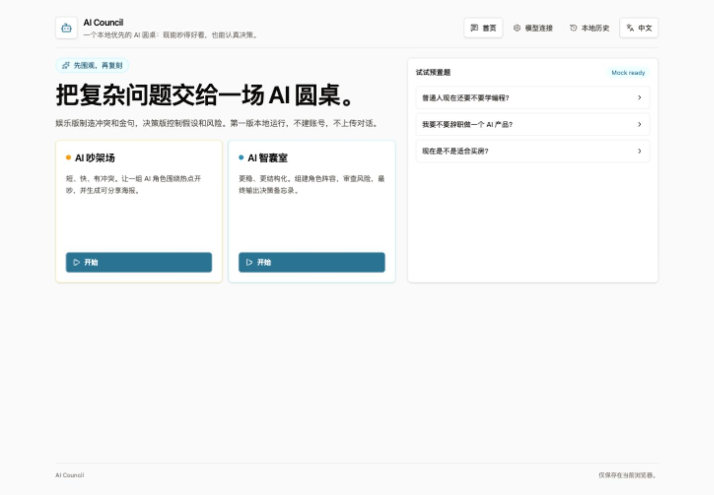
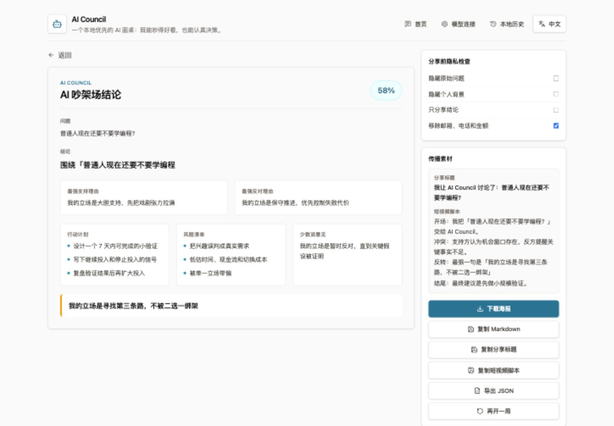

# AI Council

AI Council is a frontend-first experiment for bringing multiple AI roles into one debate room: a playful debate arena for shareable arguments, and a serious council room for structured decisions.





## Product Direction

- **AI Debate Arena**: entertainment-first, optimized for conflict, quotes, posters, and replayable topics.
- **AI Council Room**: decision-first, optimized for context gathering, risk review, dissent, and action plans.
- **BYOK / BYOP**: users bring their own API keys or proxy URLs. The project does not provide model service, store API keys, or pay model costs.
- **Local-first sharing**: v1 avoids an official public gallery. Posters, long images, copied summaries, and history stay local unless the user shares them manually.
- **Bilingual by default**: the UI supports Chinese and English, auto-selecting the browser language while keeping a manual switch.

## Tech Stack

- React
- Vite
- TypeScript
- Tailwind CSS
- Zustand
- IndexedDB

## Local Development

```bash
npm install
npm run dev
npm run build
npm run lint
```

## Release Checklist

```bash
npm ci
npm run lint
npm run build
```

Before publishing, confirm GitHub Pages is set to **GitHub Actions** in the repository settings.

## Usage

1. Open the app.
2. Try the mock flow without any API key.
3. Add an OpenAI-compatible model connection when you want real model calls.
   - OpenAI official: `https://api.openai.com/v1`
   - OpenRouter or compatible relay: `https://openrouter.ai/api/v1`
   - Custom relay or self-hosted proxy: use its OpenAI-compatible `/v1` base URL.
4. If the browser blocks CORS, use your own Worker, Function, local proxy, or compatible relay endpoint.
5. Build a council lineup, optionally optimize model seats, and start the meeting.
6. Export the result as a poster, Markdown, JSON, share title, or short-video script.
7. Keep everything local unless you manually share an exported asset.

For deployment, see [docs/deployment.md](docs/deployment.md).
For privacy and key-handling details, see [docs/security.md](docs/security.md).

## v1 Provider Scope

- Mock provider for a complete no-key demo flow.
- OpenAI-compatible Chat Completions adapter for relay, aggregator, and self-hosted compatible endpoints.
- Additional adapters such as Anthropic Messages, Gemini, and OpenAI Responses are post-v1.

## Current v1 Shell

- Chinese and English UI with browser-language auto detection and manual switching.
- Mock debate/council flow from topic input to role lineup, staged meeting, result page, and local history.
- Model connection screen with Mock Provider and OpenAI-compatible connection testing.
- Editable role prompts, model seats, and model-failure fallback policy before each session.
- Local privacy-first result sharing through poster download, Markdown copy, JSON export, share title, and short-video script.
- Council diversity scoring to nudge users from one model seat toward richer multi-model lineups.

## What AI Council Does Not Provide

- Hosted model service
- Official public conversation gallery
- Server-side account system
- Server-side conversation storage
- Server-side API key storage
- Model usage credits or billing coverage

See [docs/product-spec.md](docs/product-spec.md) for the MVP interaction model and required safety modules.
